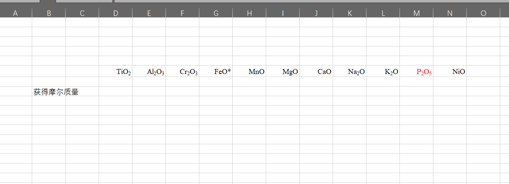
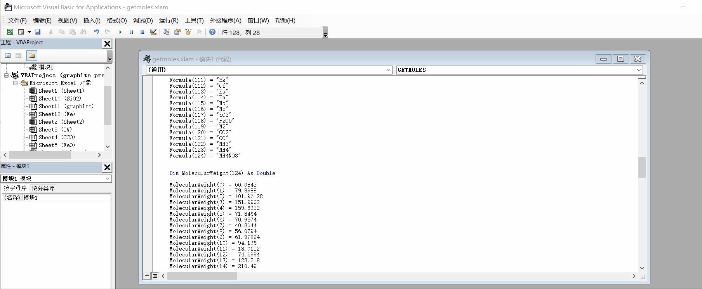

# Excel-tools

Excel custom Function

## getMols

1.新建Excel表格，（最好关闭别的Excel表），按alt + F11，点击插入，模块，复制代码（复制getMolecularWeigth.txt里全部的内容），代码里的摩尔质量可以自己添加，修改。

2.返回表格界面，保存表格，文件类型选为，Excel加载宏（*.xlam），文件夹自动跳转到特定的文件夹（…\AddIns）。命名（例如getMoles.xlam），保存在此文件夹。

3.再打开Excel，点击文件，点选项，点击加载项，在“管理：Excel加载项”右边，点转到，勾选刚才代码里的函数名（getmoles），确定，这就相当于全局启用了这个函数，以后在任何一个Excel表格中都可以把这个函数当做内置函数一样使用。

4.在表格中和=sum类似的输入=getmoles，氧化物名字无所谓大小写，有空格也行（比如feo也可以）。

